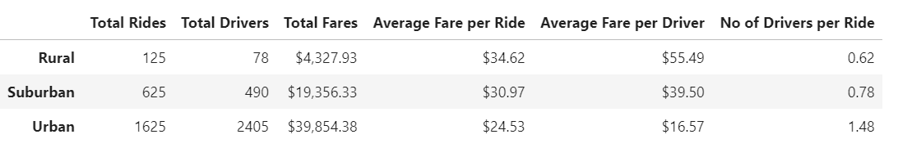
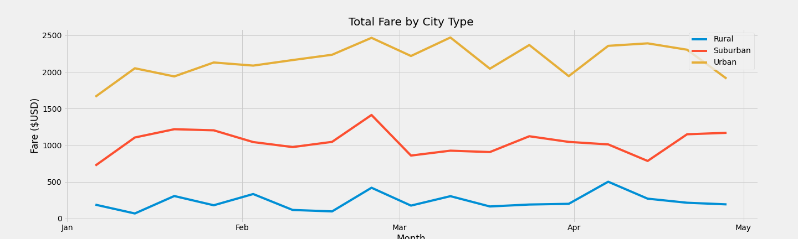
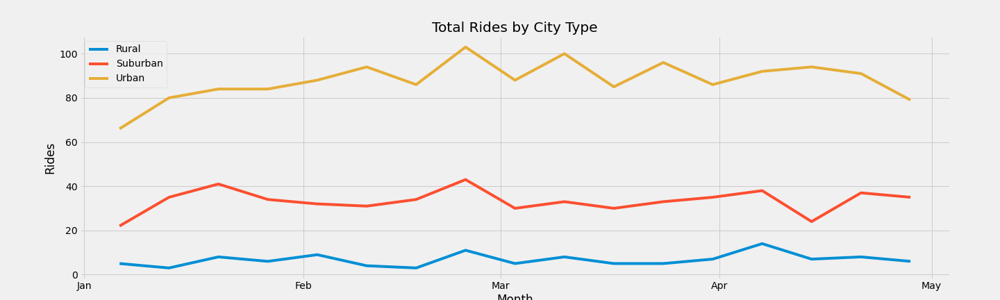

# PyBer_Analysis
## Overview

PyBer is a ride sharing company that runs its operations across US. The goal is to perform exploratory data analysis on Pyber's 2019 data to help understand the relationship between each city type and number of drivers and riders. 

Additionally we want to look at the total weekly fares for each city type using visual representation.

This data visualization will help PyBer's management to improve ride sharing services and determine affordability for under-serve areas. 

### Resources:
The data files used for the analysis are [city_data.csv](resources/city_data.csv) and [ride_data.csv](resources/ride_data.csv). 
The exploratory data analysis has been performed using **Python**, **Pandas DataFrame** and **Matplotlib** libraries.

## Results
### Find corelation between city type, number of drivers and number of riders:
Let's look at the table below:

1. The demand for rides in Urban (1625) area is more than those in Rural (125) and Suburban (625) areas. 
2. However, what is interesting here is number of drivers (2405) in urban areas are higher than number of rides where as in Suburban and Rural areas the number of drivers are lower than the number of rides.
3. This could be the reason that the average fare per ride in Urban areas ($24.53) is lower than the average fares in Rural ($34.62) and Suburban ($30.97) areas because supply in Urban area is more than the demand for rides. 
4. Similarly, because of the low supply of drivers (78) and higher demand for rides (125) in ural areas the average fare for drivers is higher ($55.49) for Rural drivers as compared to Urband ($16.57) and Suburban ($39.50) drivers.
5. Inspite of lower average fare per ride and lower average fare per driver, the total fare for Urban ($39,854) area is still higher as compared to Rural ($4,328) and Suburban ($19,356) areas. 
    

### Weekly Fare Summary by City Type
Let's look the chart below to understand weekkly fare for each city type. Please note that the below chart depicts data only from 01-01-2019 to 04-28-2019.

The chart above shows that the Urban areas had greater total fare on week to week basis as compared to Rural and Suburban areas. This shows that the demand in all 3 city types were consistent on a weekly basis.

We also observed that in all three city types there was a rise in the total fare in late February but other wise varied in other weeks.

Next, I wanted to check if the total weekly fares had any corelation with total weekly rides.

From the two charts above, looks like the cadence of total rides is similar to total fares. 

## Summary
When looking into the data to make recommendations, considerations should be made for residents as well as for drivers. While the goal is to provide more affordable rides for area residents, it is important that the profitablity for drivers is also maintained. 

Based on the given data, the following recommendations can be made:

1. Suburban area seems to hit the right mix of drivers and demand for rides. Something similar should be modeled for rural areas by slightly increasing the number of drivers so that the average fare per ride would decrease for residents thus improving affordability for rural area residents.
   
2. Similarly, for Urban areas there seem to be more drivers available than the demand for rides. It makes the rides more affordable for residents, however it could also mean lower earnings for the drivers. Thus, slightly decreasing the number of drivers in the Urban areas will improve the profitability for drivers while still providing competitive rates for Urban residents.

3. Now, we also know that there are other factors that could contribute to different fare amounts that we observed in Urban, Suburban and Rural areas. For example, the increased fare for Rural areas could be due to more distance traveled by rural area riders. Or the increased number of drivers in the Urban area are justified because these areas have higher population. So, in order to get more insight into the relationship between city type, number of riders and driver we should collect and analyze more data like City Type Population, Rider Satisfaction, Idle time for Drivers, Wait time for Riders etc. This will help in gaining a better understanding of how different factors could be contributing ride affordability as well as driver profitability.  

